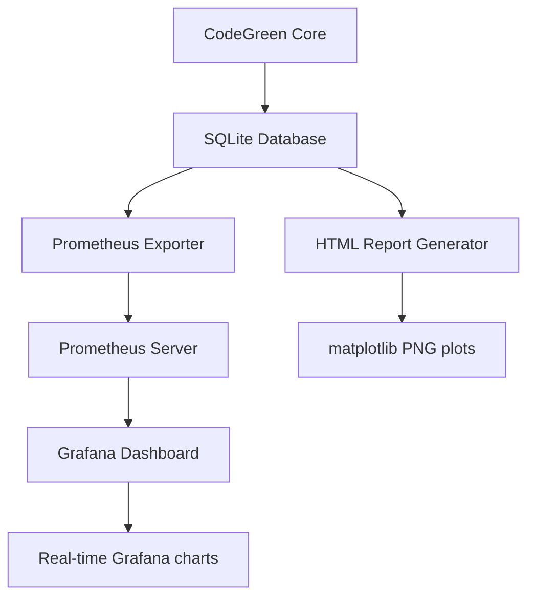

# CodeGreen Architecture & Data Flow Cleanup Guide

## 📊 Current Data Flow



## 🎯 Components Analysis

### **SQLite Database** ✅ KEEP - Primary Data Store
- **File**: `energy_data.db`
- **Purpose**: Persistent storage for all energy measurements
- **Used by**: HTML reports, Prometheus exporter, CodeGreen core
- **Tables**: `sessions`, `checkpoints`, `function_energy_stats`, `energy_timeline`

### **HTML Report Generator** ✅ KEEP - Detailed Analysis
- **File**: `scripts/generate_energy_report.py`
- **Purpose**: Detailed code-line energy analysis with peak detection
- **Data source**: SQLite database  
- **Output**: matplotlib PNG plots + HTML report
- **Unique features**: Code-line mapping, peak vs noise detection

### **Prometheus Exporter** ✅ KEEP - Real-time Metrics
- **File**: `monitoring/prometheus_exporter.py`
- **Purpose**: Convert SQLite data to Prometheus format
- **Data source**: SQLite database
- **Output**: Prometheus metrics on :8080/metrics
- **Unique features**: Real-time monitoring, time-series data

### **Grafana Dashboard** ✅ KEEP - Live Monitoring
- **File**: `grafana/codegreen-dashboard.json`
- **Purpose**: Real-time visualization and monitoring
- **Data source**: Prometheus server
- **Unique features**: Live updates, historical trends, alerts

## 🧹 Files to REMOVE (Redundant)

### ❌ Old Dashboard - ALREADY REMOVED
- ~~`grafana/dashboards/energy_monitoring.json`~~ ✅ **DELETED**
- Was using SQL queries instead of Prometheus

### ❌ Duplicate Report Directories
```bash
# Keep only the enhanced reports
rm -rf reports_demo/     # Demo data only
# Keep: reports_enhanced/ (has code-line analysis)
```

### ❌ Build Artifacts  
```bash
# Clean build cache
rm -rf build/
mkdir -p build && cd build && cmake .. && make -j4
```

## 📈 Plot Generation Explained

### **HTML Reports (matplotlib)**
- **Source**: SQLite database
- **Processing**: Python matplotlib/seaborn
- **Output**: Static PNG files
- **Features**: 
  - Code-line energy mapping
  - Peak detection algorithm  
  - Function analysis
  - Timeline visualization

### **Grafana Charts (Grafana/Prometheus)**
- **Source**: Prometheus metrics (from SQLite)
- **Processing**: Grafana rendering engine
- **Output**: Interactive web charts
- **Features**:
  - Real-time updates
  - Historical trends
  - Alerting capabilities
  - Multi-session comparison

## 🔄 Why Both Systems?

| Feature | HTML Reports | Grafana Dashboard |
|---------|-------------|-------------------|
| **Data Detail** | High (code-line level) | Medium (checkpoint level) |
| **Update Frequency** | On-demand | Real-time |
| **Peak Detection** | ✅ Advanced algorithm | ❌ |  
| **Code Attribution** | ✅ Source line mapping | ❌ |
| **Historical Analysis** | ✅ Deep dive | ✅ Trends |
| **Live Monitoring** | ❌ | ✅ |
| **Alerting** | ❌ | ✅ |

## 🎯 Recommended Cleanup Actions

### 1. Remove Redundant Report Directories
```bash
cd /home/srajput/codegreen
rm -rf reports_demo/     # Demo data only
ls reports_enhanced/     # Keep this - has enhanced analysis
```

### 2. Clean Build Artifacts
```bash
# Clean and rebuild
make clean 2>/dev/null || true
rm -rf build/
mkdir -p build && cd build && cmake .. && make -j4
```

### 3. Optimize Database Usage
```bash
# Check database size
ls -lh energy_data.db

# Optional: Vacuum database to reduce size
sqlite3 energy_data.db "VACUUM;"
```

### 4. Consolidate Monitoring Scripts
```bash
# Keep these monitoring scripts:
ls scripts/start_monitoring.sh     # ✅ Start Prometheus + Grafana
ls scripts/stop_monitoring.sh      # ✅ Stop monitoring stack  
ls scripts/view_reports.py         # ✅ View HTML reports
ls scripts/generate_energy_report.py  # ✅ Generate enhanced reports
```

## 🚀 Optimal Workflow

### For Development/Analysis:
1. Run CodeGreen: `./bin/codegreen python3 your_script.py`
2. Generate enhanced reports: `python3 scripts/generate_energy_report.py`
3. View code-line analysis: `python3 scripts/view_reports.py`

### For Production/Monitoring:
1. Start monitoring: `./scripts/start_monitoring.sh`
2. Run continuous measurements
3. Monitor in Grafana: http://localhost:3000

## 📊 Data Flow Summary

**SQLite is the single source of truth** - everything else reads from it:
- HTML reports for detailed analysis
- Prometheus exporter for real-time monitoring  
- Both use the same data but serve different purposes

**No redundancy** - each component adds unique value!