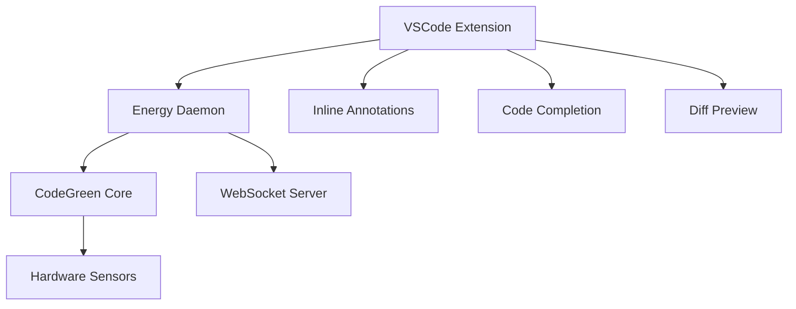
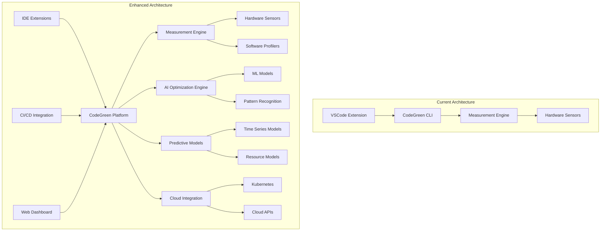
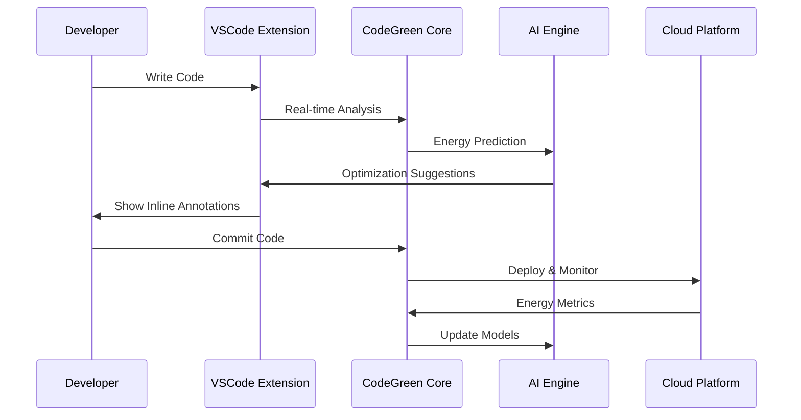

## �� **Feature Analysis & Implementation Strategy**

### **Phase 1: Foundation & Quick Wins (3-6 months)**

#### **1. Real-Time IDE Integration** 💻
**Priority**: ⭐⭐⭐⭐⭐ | **Complexity**: Medium | **ROI**: Very High

**Design Approach:**
```typescript
// VSCode Extension Architecture
interface EnergyMonitor {
  // Real-time energy tracking
  startMonitoring(): void;
  stopMonitoring(): void;
  getCurrentEnergy(): EnergyReading;
  
  // Inline annotations
  addInlineAnnotations(editor: TextEditor): void;
  updateEnergyCosts(codeChanges: CodeChange[]): void;
  
  // Code completion integration
  provideEnergyAwareCompletions(context: CompletionContext): CompletionItem[];
}
```

**Implementation Strategy:**
1. **Live Energy Monitoring**: Extend current extension with WebSocket connection to CodeGreen daemon
2. **Inline Annotations**: Use VSCode's `InlineValueProvider` API
3. **Code Completion**: Integrate with existing completion providers
4. **Performance Impact Preview**: Use VSCode's diff editor with energy annotations

**Technical Architecture:**


#### **2. CI/CD Energy Integration** ��
**Priority**: ⭐⭐⭐⭐ | **Complexity**: Low-Medium | **ROI**: High

**Design Approach:**
```yaml
# GitHub Actions Integration
name: Energy Analysis
on: [push, pull_request]
jobs:
  energy-analysis:
    runs-on: ubuntu-latest
    steps:
      - uses: actions/checkout@v3
      - name: Setup CodeGreen
        uses: codegreen/setup-action@v1
      - name: Energy Analysis
        run: codegreen ci-analyze --budget 100J --report-format json
      - name: Comment PR
        uses: codegreen/pr-comment@v1
```

**Implementation Strategy:**
1. **GitHub Actions**: Create reusable actions for energy analysis
2. **Energy Budgets**: Implement configurable energy limits per project
3. **PR Integration**: Auto-comment on energy impact
4. **Report Generation**: Automated energy reports for builds

### **Phase 2: Advanced Analytics (6-12 months)**

#### **3. Energy Complexity Analysis** 📊
**Priority**: ⭐⭐⭐⭐⭐ | **Complexity**: Medium | **ROI**: Very High

**Design Approach:**
```python
# Energy Complexity Analysis
class EnergyComplexityAnalyzer:
    def analyze_algorithm(self, code: str) -> EnergyComplexity:
        """Analyze energy complexity of algorithms"""
        pass
    
    def generate_big_o_notation(self, measurements: List[EnergyMeasurement]) -> BigONotation:
        """Generate Big-O energy notation"""
        pass
    
    def benchmark_algorithms(self, algorithms: List[str]) -> BenchmarkResults:
        """Compare energy efficiency of different algorithms"""
        pass
```

**Implementation Strategy:**
1. **Algorithm Analysis**: Parse code to identify algorithmic patterns
2. **Complexity Modeling**: Create mathematical models for energy vs input size
3. **Benchmarking Framework**: Standardized testing across different algorithms
4. **Research Export**: Export data in formats suitable for academic research

#### **4. AI-Powered Energy Optimization Engine** 🤖
**Priority**: ⭐⭐⭐⭐⭐ | **Complexity**: Medium | **ROI**: Very High

**Design Approach:**
```python
# AI Energy Optimization
class EnergyOptimizationEngine:
    def __init__(self):
        self.ml_model = EnergyPredictionModel()
        self.pattern_recognizer = CodePatternRecognizer()
        self.optimization_suggester = OptimizationSuggester()
    
    def predict_energy(self, code: str) -> EnergyPrediction:
        """Predict energy consumption before execution"""
        pass
    
    def suggest_optimizations(self, code: str) -> List[OptimizationSuggestion]:
        """Suggest energy-efficient refactoring"""
        pass
    
    def auto_optimize(self, code: str) -> str:
        """Automatically optimize code for energy efficiency"""
        pass
```

**Implementation Strategy:**
1. **Data Collection**: Collect energy data from existing measurements
2. **ML Model Training**: Train models on code patterns vs energy consumption
3. **Pattern Recognition**: Identify energy-inefficient patterns
4. **Optimization Suggestions**: Provide specific refactoring recommendations

### **Phase 3: Enterprise & Cloud (12-18 months)**

#### **5. Cloud & Distributed Computing Support** ☁️
**Priority**: ⭐⭐⭐⭐⭐ | **Complexity**: High | **ROI**: High

**Design Approach:**
```python
# Cloud Integration
class CloudEnergyMonitor:
    def __init__(self, platform: CloudPlatform):
        self.platform = platform
        self.kubernetes_client = KubernetesClient()
        self.cloud_apis = CloudAPIs(platform)
    
    def monitor_pod_energy(self, namespace: str) -> PodEnergyMetrics:
        """Monitor energy consumption of Kubernetes pods"""
        pass
    
    def analyze_microservices(self, services: List[str]) -> MicroserviceEnergyProfile:
        """Analyze energy across distributed services"""
        pass
```

**Implementation Strategy:**
1. **Kubernetes Integration**: Use Kubernetes metrics API for pod-level monitoring
2. **Cloud APIs**: Integrate with AWS CloudWatch, Azure Monitor, GCP Monitoring
3. **Microservices Profiling**: Distributed tracing with energy attribution
4. **Container Isolation**: Per-container energy measurement

#### **6. Predictive Energy Modeling** 🔮
**Priority**: ⭐⭐⭐⭐⭐ | **Complexity**: High | **ROI**: Very High

**Design Approach:**
```python
# Predictive Energy Modeling
class PredictiveEnergyModel:
    def __init__(self):
        self.time_series_model = TimeSeriesModel()
        self.resource_model = ResourceUtilizationModel()
        self.thermal_model = ThermalModel()
    
    def predict_energy(self, workload: Workload, hardware: HardwareConfig) -> EnergyPrediction:
        """Predict energy consumption for given workload and hardware"""
        pass
    
    def what_if_analysis(self, code_changes: List[CodeChange]) -> WhatIfResult:
        """Simulate energy impact of code changes"""
        pass
    
    def optimize_scheduling(self, tasks: List[Task]) -> OptimalSchedule:
        """Optimize task scheduling for energy efficiency"""
        pass
```

## 🏗️ **Technical Architecture Design**

### **Core Architecture Evolution**



### **Data Flow Architecture**



## 📋 **Implementation Roadmap**

### **Phase 1: Foundation (Months 1-6)**
1. **Real-Time IDE Integration** (Month 1-2)
   - WebSocket-based live monitoring
   - Inline energy annotations
   - Code completion integration

2. **CI/CD Integration** (Month 3-4)
   - GitHub Actions integration
   - Energy budget enforcement
   - PR energy impact comments

3. **Energy Complexity Analysis** (Month 5-6)
   - Algorithm analysis framework
   - Big-O energy notation
   - Benchmarking tools

### **Phase 2: Intelligence (Months 7-12)**
1. **AI Optimization Engine** (Month 7-9)
   - ML model training
   - Pattern recognition
   - Optimization suggestions

2. **Predictive Modeling** (Month 10-12)
   - Energy prediction models
   - What-if analysis
   - Resource optimization

### **Phase 3: Enterprise (Months 13-18)**
1. **Cloud Integration** (Month 13-15)
   - Kubernetes support
   - Cloud platform APIs
   - Microservices profiling

2. **Hardware-Aware Optimization** (Month 16-18)
   - CPU architecture optimization
   - GPU energy profiling
   - Thermal-aware computing

## 🎯 **Success Metrics & KPIs**

### **Technical Metrics**
- **Accuracy**: Energy prediction accuracy > 90%
- **Performance**: Real-time analysis latency < 100ms
- **Coverage**: Support for 95% of common programming patterns
- **Integration**: Seamless integration with major IDEs and CI/CD platforms

### **Business Metrics**
- **Adoption**: 10,000+ active users within 18 months
- **Energy Savings**: 20-30% average energy reduction for users
- **Developer Productivity**: 15% reduction in energy debugging time
- **Enterprise Adoption**: 100+ enterprise customers

## 🚀 **Getting Started**

### **Immediate Next Steps (Week 1-2)**
1. **Extend Current VSCode Extension**
   - Add WebSocket connection for real-time monitoring
   - Implement inline energy annotations
   - Create energy-aware code completion

2. **Create GitHub Actions Integration**
   - Build reusable GitHub Actions
   - Implement energy budget checking
   - Add PR energy impact reporting

3. **Design Data Collection Framework**
   - Extend current measurement engine
   - Create structured data export
   - Implement data anonymization for ML training

### **Technical Prerequisites**
- **ML/AI Infrastructure**: TensorFlow/PyTorch for model training
- **Cloud Infrastructure**: Kubernetes, AWS/Azure/GCP APIs
- **Real-time Communication**: WebSocket servers, message queues
- **Data Storage**: Time-series databases for energy metrics

This comprehensive approach will transform CodeGreen from a measurement tool into a complete energy-aware development platform, positioning it as the industry standard for sustainable software development! 🌱