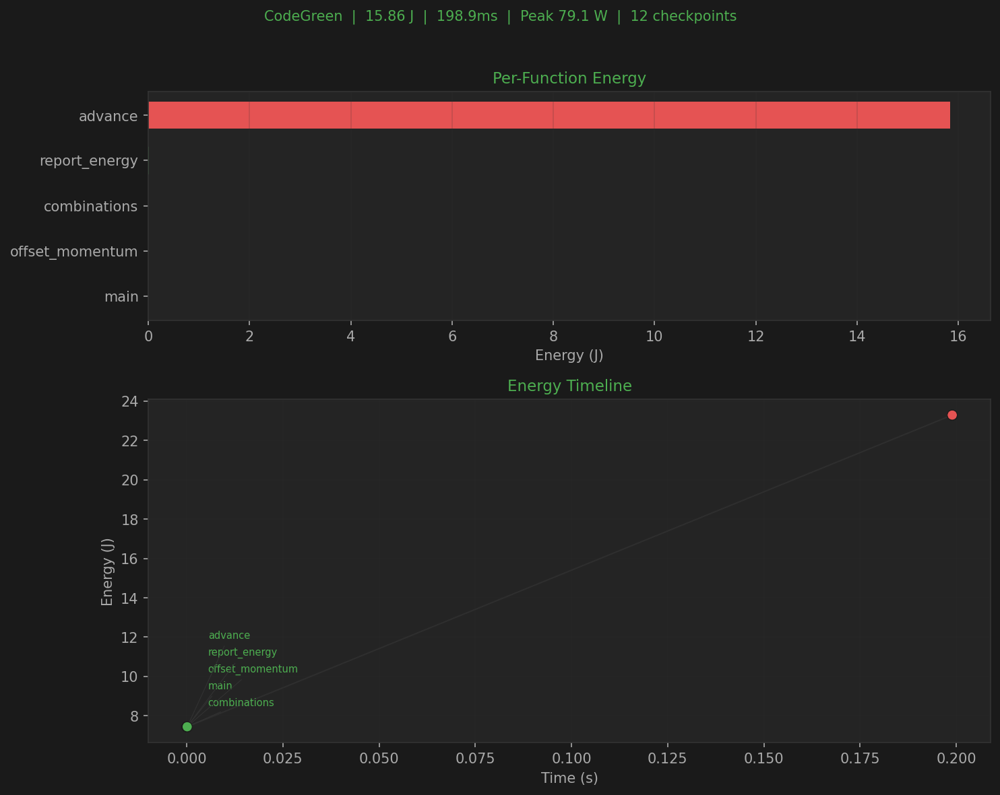

# Reports & Visualization

CodeGreen provides multiple output formats and an interactive energy timeline visualization.

## Output Formats

### Console Output (default)

```bash
codegreen measure python script.py -g fine
```

Prints total energy, wall time, and per-function breakdown to the terminal.

### JSON Output

```bash
codegreen measure python script.py --json
```

Machine-readable JSON with analysis metadata, measurement results, and checkpoint data.

### CSV Output

```bash
codegreen measure python script.py --csv
```

### Markdown Output

```bash
codegreen measure python script.py --markdown
```

### File Output

```bash
codegreen measure python script.py -o results.json
```

## Energy Timeline Visualization



*N-body simulation (50,000 iterations): `advance` identified as the energy hotspot at 17.21J. Timeline shows linear energy ramp during computation.*

### Interactive HTML (Plotly)

```bash
codegreen measure python script.py -g fine --export-plot energy.html
```

Generates a self-contained HTML file with:

- **Function Energy Bar Chart**: Horizontal bars sorted by energy. Hotspots (>90th percentile) in red.
- **Zoomable Timeline**: Energy vs time scatter plot. Green = enter, red = exit. Supports scroll zoom, drag pan, box select, hover tooltips.
- **Summary Statistics**: Total energy (J), wall time, average/peak power (W), checkpoint count.

Works offline -- Plotly.js is embedded in the file.

For large checkpoint counts (100K+), hotspot-aware downsampling preserves energy-intensive functions.

### Static Image (matplotlib)

```bash
codegreen measure python script.py -g fine --export-plot energy.png
```

Dual-panel image: function energy bars (top) + timeline scatter (bottom). Requires `pip install matplotlib`.

### Dependencies

| Format | Dependency | Install |
|--------|-----------|---------|
| `.html` | plotly | `pip install plotly` |
| `.png` / `.pdf` | matplotlib | `pip install matplotlib` |

Or: `pip install -e ".[viz]"`

## Reading the Results

- **Energy (J)**: Cumulative energy from RAPL counter
- **Delta (J)**: Energy between consecutive checkpoints
- **Power (W)**: Instantaneous power at each checkpoint
- **Hotspots**: Functions exceeding 90th percentile energy
